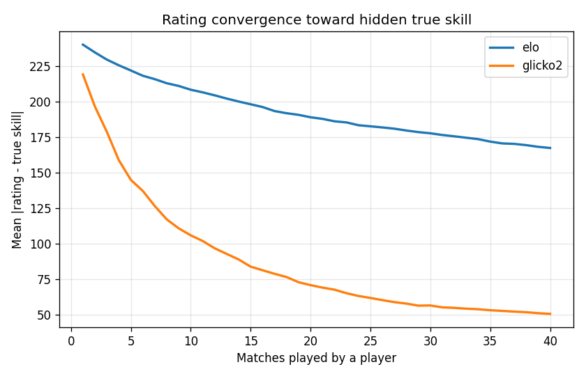
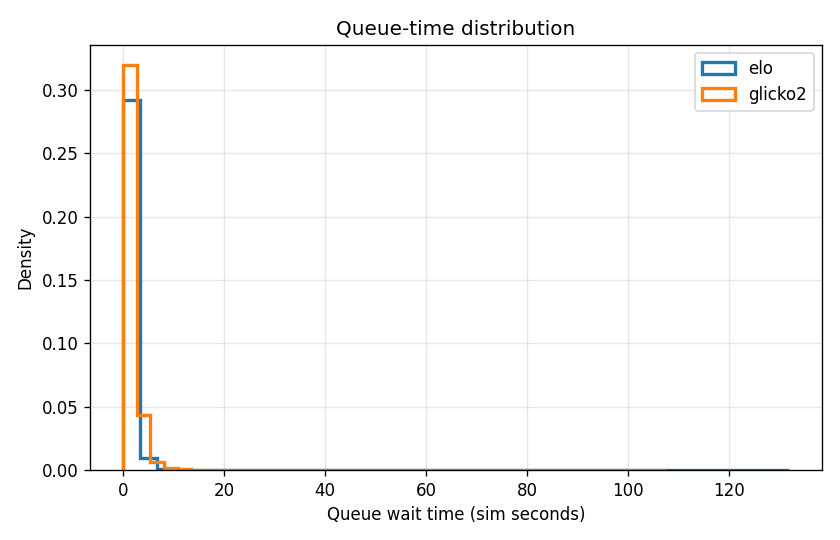
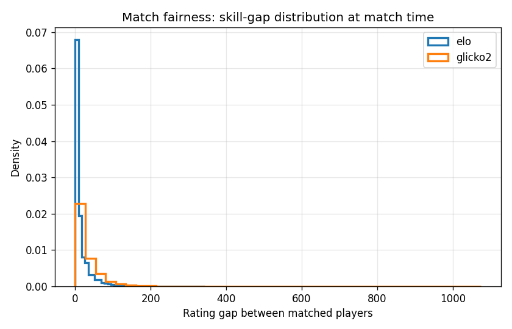
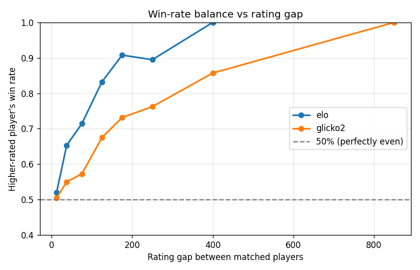

# Matchmaking Engine

[](https://github.com/ducal7/matchmaking-engine/actions/workflows/ci.yml) [](LICENSE) [](https://www.python.org/)


A skill-based **matchmaking simulator** that pairs players from a live queue,
plays out their games from hidden true skill, and learns each player's strength
with a pluggable rating system (**Elo** or **Glicko-2**). It is a discrete-event
simulation (SimPy) with an evaluation harness that measures match fairness,
queue time, rating convergence, and win-rate balance.

Everything here runs on **synthetic, seeded data** generated inside the repo —
there are no external datasets and no credentials.

## The problem: quality vs. wait time

Online matchmaking is a trade-off:

- **Match quality** wants opponents of near-equal skill (a small skill gap), so
  games are close and fun.
- **Wait time** wants players matched *now*; nobody likes staring at a queue.

These pull against each other. If you only ever accept a perfect opponent, rare
players (very strong or very weak) wait forever. If you match anyone instantly,
you get blowouts. The matcher here resolves this by **widening the acceptable
skill window the longer a player waits**:

```
acceptable_gap(wait) = min(base_window + widen_per_second * wait, max_window)
```

A freshly queued player only accepts near-equal opponents; a long-waiting player
accepts a progressively wider spread. A pair is matched when the rating gap fits
inside the window of the *longer-waiting* of the two, and among all acceptable
pairs the smallest gap wins.

## Why rating uncertainty matters

You can't match on skill you don't know yet. A brand-new player's rating is a
guess. **Elo** treats every rating as equally certain and nudges it by a fixed
step `K` each game — simple, but slow to find a true skill and noisy forever
after. **Glicko-2** additionally tracks a **rating deviation (RD)** — how unsure
we are — plus a **volatility**. Uncertain players move fast toward their true
skill and settle as confidence grows. The results below show Glicko-2
converging roughly **3× closer** to true skill than Elo over a player's first 40
games.

## How it works

| Component | File | Role |
|-----------|------|------|
| Rating systems | `src/matchmaking/ratings.py` | `Elo` and `Glicko2` behind a common `RatingSystem` interface |
| Matcher | `src/matchmaking/matcher.py` | Wait-aware widening-window pairing |
| Outcome model | `src/matchmaking/outcomes.py` | Bradley-Terry / logistic win probability from true skill |
| Players | `src/matchmaking/players.py` | Seeded synthetic players with hidden true skill |
| Simulation | `src/matchmaking/simulate.py` | SimPy discrete-event queue + matchmaker |
| Evaluation | `src/matchmaking/evaluate.py` | Metrics and committed plots |

Players arrive into a shared queue over time (exponential think times). A
matchmaker process ticks periodically, pairs players, decides each game from the
two players' hidden true skills via a logistic model, and updates their ratings.
Every match is logged for evaluation.

## Running it

Requires Python 3.11.

```bash
make venv     # create .venv and install pinned deps (numpy, simpy, pandas, matplotlib)
make sim      # run the simulation + regenerate all plots in results/
make lint     # ruff check
make test     # pytest
make all      # lint + test + sim
```

Or directly:

```bash
python -m matchmaking.simulate            # full run (1000 players, 40 matches each)
python -m matchmaking.simulate --no-plots # just print the summary
```

Runs are **deterministic** for a fixed `--seed` (default `20260626`).

## Results

The default run simulates **1,000 players × 40 matches each (~20,000 matches)**
per rating system. Headline numbers from the committed run:

| Rating system | Final mean rating error | Median queue time | Even-match favourite win rate |
|---------------|------------------------:|------------------:|------------------------------:|
| Elo           | ~171 | ~1.1 s | 0.521 |
| Glicko-2      | ~53  | ~1.3 s | 0.505 |

"Final mean rating error" is the average `|rating − true_skill|` over each
player's last few games (true skills are drawn from `N(1500, 300)`).
"Even-match" = matches with a rating gap under 25 points.

### Rating convergence



Both systems pull ratings toward hidden true skill, but Glicko-2 converges much
faster and to a lower floor because it uses its rating-deviation to take large,
confident early steps. Elo's fixed step size leaves a persistent noise floor.

### Queue-time distribution



Most players match almost immediately (median ~1 s) because the queue is well
supplied. The **tail** (out to ~100+ s) is exactly the hard-to-match
outlier-skill players — and it is their widening window that lets them get a
game at all, demonstrating the quality-vs-wait trade-off in action.

### Match fairness (skill-gap distribution)



The rating gap at match time is tightly concentrated near zero (median ~5 points
for Elo, ~18 for Glicko-2; Glicko-2's gaps reflect its wider early
rating spread). Large gaps are rare and correspond to widened-window matches for
queue outliers.

### Win-rate balance



For evenly matched games the higher-rated player wins ~50% of the time — the
matchmaker is producing genuinely fair games. As the rating gap grows the
favourite's win rate climbs smoothly toward 100%, which is the correct,
well-calibrated behaviour: a bigger (real) skill edge should win more often.

## Tests

`pytest` covers:

- **Elo correctness** — winner gains / loser loses, expected-score symmetry,
  zero-sum updates, and that upsets move more points than expected wins.
- **Glicko-2 correctness** — reproduces the worked example from Glickman's paper
  (1500/200/0.06 vs three opponents → 1464.06 / 151.52 / 0.05999), RD grows when
  idle and shrinks after games.
- **Matcher** — the acceptable window widens with wait time and admits a distant
  opponent only once enough time has passed; smallest-gap pairs are preferred.
- **Convergence** — over a full (small) simulation, mean rating error vs. true
  skill decreases substantially from a player's first games to their last.

## Project layout

```
matchmaking-engine/
├── src/matchmaking/      # package: ratings, matcher, outcomes, players, simulate, evaluate
├── tests/                # pytest suite
├── results/              # committed evaluation plots (PNG)
├── .github/workflows/    # CI: ruff + pytest on Python 3.11
├── pyproject.toml        # pinned deps + ruff/pytest config
├── Makefile              # sim / plots / test / lint / all
└── LICENSE               # MIT
```

Raw per-match CSV logs are written to `data/` and are git-ignored; the small
result plots in `results/` are committed.

## License

MIT © 2026 Aditya Singh Rathore
